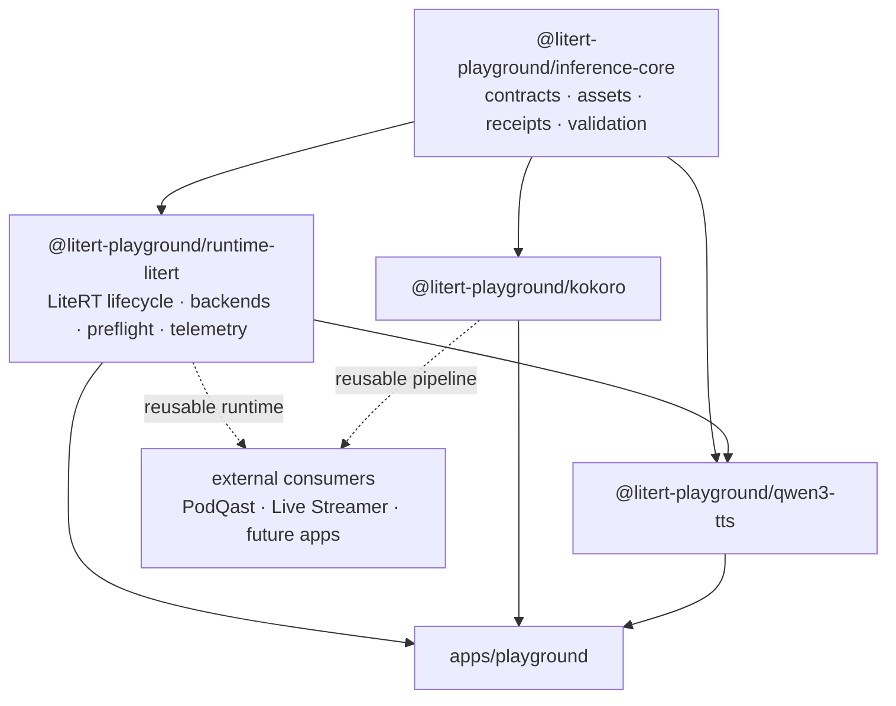

# litert-playground

A local-first browser inference workspace built around LiteRT.js.

`litert-playground` is both an interactive model lab and a shared package home for
runtime infrastructure that can be reused by other applications. The goal is
simple: **prove a capability once, package it once, and consume it everywhere**
instead of rebuilding browser inference plumbing in every project.

The workspace currently focuses on LiteRT runtime management, text-to-speech,
model qualification, and reusable inference contracts.

## What it provides

### Shared LiteRT runtime

`@litert-playground/runtime-litert` wraps `@litertjs/core` with the lifecycle and
runtime behavior needed by real applications:

- WebGPU, WebNN, and WASM capability probing
- automatic backend order: **WebGPU → WebNN → WASM**
- strict behavior when a backend is explicitly requested
- compiled-model caching
- concurrent load deduplication
- caller-specific cancellation for deduplicated loads
- safe invalidation of pending loads during model disposal
- named-signature inference
- model preflight with bounded synthetic inputs
- automatic cleanup of temporary preflight tensors and outputs
- shared inference coordination for serialized accelerator work
- compile, inference, fallback, and preflight telemetry
- bounded telemetry history
- tensor helpers and GPU-buffer capability probing
- safe model/runtime disposal

The existing lightweight `RuntimeContext` contract remains usable by model
packages that only need `loadModel`, `loadNpy`, and `fetchBuffer`. The managed
runtime is additive rather than a replacement for those package contracts.

### Playground dogfooding

The React playground uses `@litert-playground/runtime-litert` itself. It does not
maintain a separate private LiteRT loader.

That means runtime behavior exercised in the playground is the same behavior
intended for downstream consumers. The UI exposes:

- requested vs. resolved accelerator
- compile timing
- fallback count
- model preflight
- preflight timing and output count
- recent runtime/inference events

Changing the accelerator also reloads the selected model, so the UI cannot claim
a backend that the currently compiled model is not actually using.

## Architecture



The dependency direction is intentionally generic → specific. Product concepts
such as episodes, stream state, OBS control, game logic, or UI semantics belong
in consuming applications rather than in the shared runtime packages.

## Workspace layout

| Path | Package | Purpose |
|------|---------|---------|
| `apps/playground` | `playground` | React + Vite + Tailwind model lab; consumes the shared runtime |
| `packages/inference-core` | `@litert-playground/inference-core` | Model manifests, asset resolvers, receipts, validation, errors, shared contracts |
| `packages/runtime-litert` | `@litert-playground/runtime-litert` | Managed LiteRT.js runtime, backend selection, caching, preflight, coordination, telemetry |
| `packages/kokoro` | `@litert-playground/kokoro` | Kokoro TTS through `kokoro-js` using q8/WASM |
| `packages/qwen3-tts` | `@litert-playground/qwen3-tts` | Phased Qwen3-TTS pipeline over talker, MTP, and codec LiteRT graphs |
| `packages/text-gen` | `@litert-playground/text-gen` | Text generation experiments; currently frozen |
| `examples/minimal-kokoro` | `@litert-playground/example-kokoro` | Minimal standalone Kokoro browser example |
| `examples/minimal-qwen3-tts` | `@litert-playground/example-qwen3-tts` | Minimal Qwen3-TTS example and compatibility harness |

Workspace globs cover `apps/*`, `packages/*`, and `examples/*`.

## Quick start

Requirements:

- Node.js 22+
- pnpm 11+

```bash
pnpm install
pnpm dev
```

The development command starts `apps/playground`.

Before merging runtime or package changes, run:

```bash
pnpm verify
```

`pnpm verify` is also the authoritative CI gate.

## Commands

| Command | Runs |
|---------|------|
| `pnpm install` | Install workspace dependencies |
| `pnpm dev` | Start the playground dev server |
| `pnpm build` | Build all workspace projects |
| `pnpm preview` | Preview the playground production build |
| `pnpm test` | Run tests in all workspace projects |
| `pnpm test:boundaries` | Verify package dependency and architecture boundaries |
| `pnpm test:watch` | Watch-mode tests for the playground |
| `pnpm typecheck` | Type-check all workspace projects |
| `pnpm verify` | Typecheck + tests + boundary tests + production builds |

GitHub Actions runs the same verification gate for pull requests.

## Runtime example

Inside the workspace, a managed LiteRT runtime can be created from the shared
asset resolver and runtime packages:

```ts
import { createHttpAssetResolver } from '@litert-playground/inference-core'
import { createLiteRtRuntime } from '@litert-playground/runtime-litert'

const context = await createLiteRtRuntime({
  backend: 'auto',
  assets: createHttpAssetResolver('https://example.com/models/'),
})

const model = await context.liteRt.loadModel('model.tflite')

console.log(context.backend)
console.log(context.liteRt.getModelInfo('model.tflite'))
```

Model qualification can use the same runtime:

```ts
const result = await context.liteRt.preflight('model.tflite')

console.log({
  backend: result.resolvedBackend,
  compileMs: result.compileDurationMs,
  inferenceMs: result.inferenceDurationMs,
  outputs: result.outputCount,
})
```

Preflight-generated input tensors and discarded output tensors are owned and
cleaned up by the runtime. Inputs supplied through a custom `createInputs`
callback remain caller-owned.

## TTS capability status

| Capability | Backend | Status |
|------------|---------|--------|
| **Kokoro** | Browser WASM (`kokoro-js`, q8) | **Verified** audible browser synthesis at 24 kHz mono |
| **Qwen3-TTS** | Native/local LiteRT runtime | **Classified native/local** rather than practical browser-WASM |

### Kokoro

Kokoro is the current verified browser TTS path. The package has produced real
audible browser output, not merely a successful build or mocked inference call.

`@litert-playground/kokoro` also serves as the first real external shared-package
consumer path from this repository.

### Qwen3-TTS

Qwen3-TTS is represented as three host-orchestrated LiteRT graphs:

1. talker
2. MTP
3. codec

The current model set exceeds the practical browser WASM/JavaScript memory
budget during prefill, even after experiments with MTP quantization, prompt and
codec residency, reduced KV capacity, and browser-memory variants.

The `browserMemory` manifest variant (`mtp_folded_int8`) and short-KV talker
exports remain useful compatibility probes for future LiteRT.js/runtime
improvements. The package architecture remains valuable for native/local LiteRT
consumers even where browser-WASM is not practical.

## Verification philosophy

A build passing does **not** mean a model works.

The repository separates:

- package/type correctness
- runtime compilation
- real inference
- output validation
- manual audible/visual verification where appropriate

Real-model and audio findings are kept under `docs/verification/`. The current
TTS verification record is:

- `docs/verification/2026-08-10-package-extraction.md`

No capability should be promoted to “working” from build output alone.

## Package boundaries

The repository includes boundary tests to keep the shared layer genuinely
shared. In particular:

- examples should consume public package entrypoints
- `inference-core` must remain independent of model-specific packages
- the playground must consume `runtime-litert` instead of recreating LiteRT
  loading directly
- runtime policy must remain product-independent

A useful extraction rule is:

> If the code still makes sense when none of the consuming products exist, it is
> probably a package candidate.

## External consumption

`@litert-playground/kokoro` already uses an external-consumer-friendly contract
with `@litert-playground/inference-core` as a peer dependency.

`@litert-playground/runtime-litert` is currently still marked private and uses a
workspace dependency on `inference-core`. Its runtime API is intended for reuse,
but package distribution/versioning is deliberately a separate follow-up before
other repositories pin it directly.

That keeps runtime architecture changes and package-release policy from becoming
one giant migration-shaped problem.

## Project direction

The playground is intended to become the qualification and shared-infrastructure
home for reusable local inference capabilities:

```text
prove model/runtime behavior
        ↓
add verification + receipts
        ↓
generalize the reusable layer
        ↓
publish/expose a package boundary
        ↓
consume it from applications
        ↓
feed generic improvements back into playground
```

The result should be fewer copied runtimes, fewer product-specific inference
forks, and a much clearer answer to the important question: **does this model
actually work in this environment, on this backend, with evidence?**

## License

Shared packages are currently licensed under Apache-2.0 as declared by their
package manifests.
